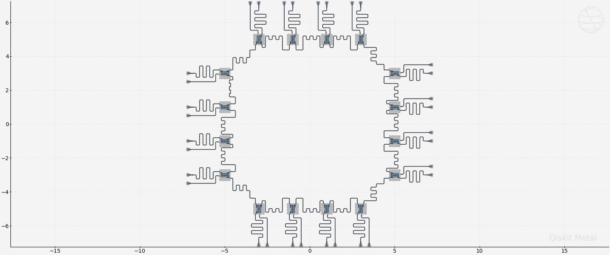
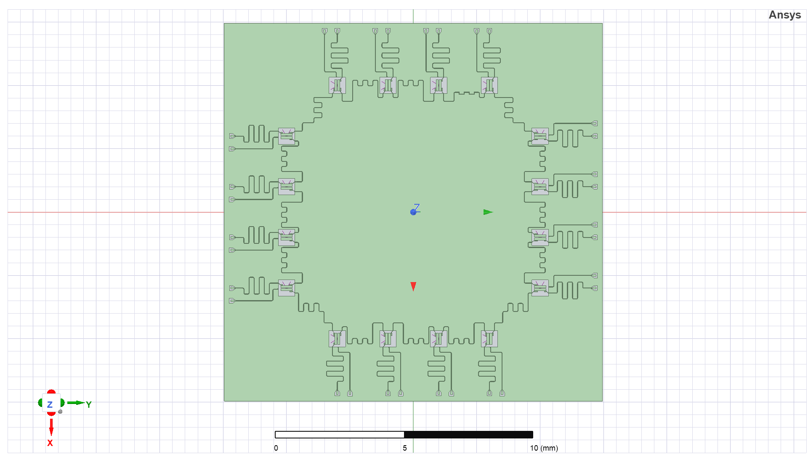
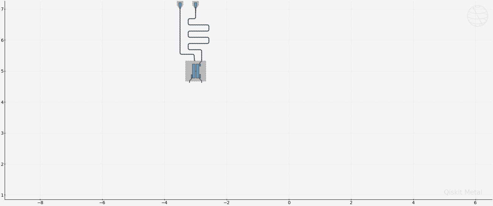
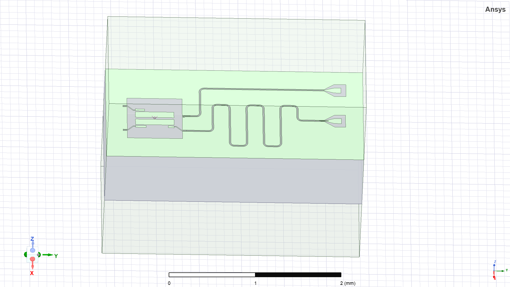
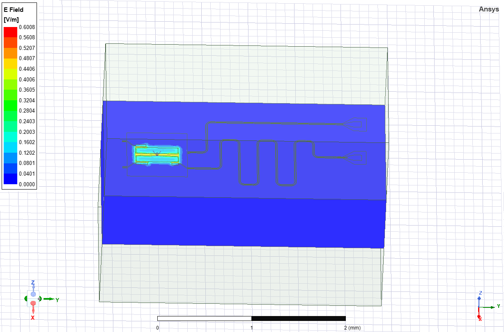
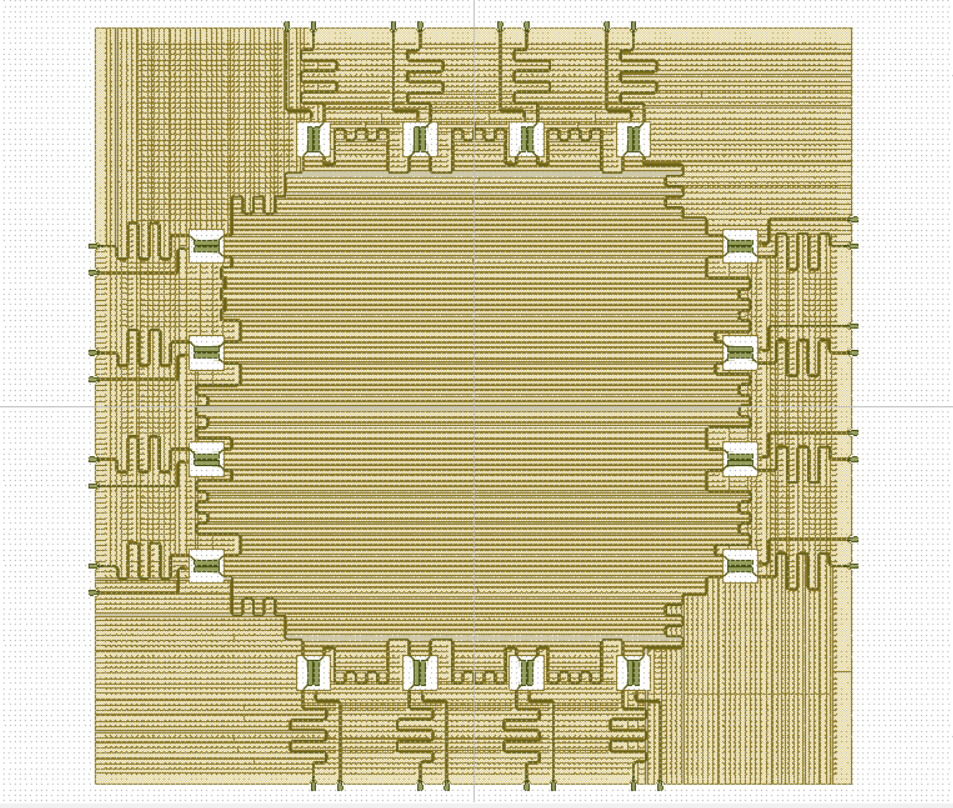

# Qiskit Metal - Qchip 16 Qubits

## Tools

- Jupyter Notebook
- Qiskit Metal
- Ansys

## Features

- Hamiltonian
- Qiskit Metal Layout
- EPR Analysis
- LOM Analysis
- GDSII

## Demonstration

#### Qiskit Metal Layout

#### Ansys Render

#### Qiskit Metal 
Must be rendered and simulated partially

#### Ansys Render (Only Transmon) 
Must be rendered and simulated partially

#### Ansys Sim (Only Transmon) 
Must be rendered and simulated partially

#### GDSII

## Appendix

Any additional information goes here

## Documentation

[QMetal](https://qiskit.org/documentation/metal/)

